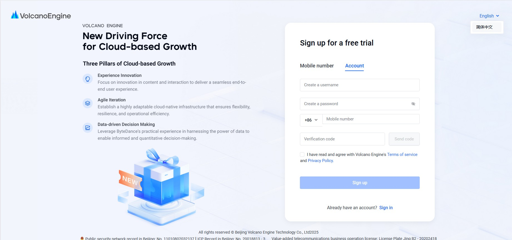
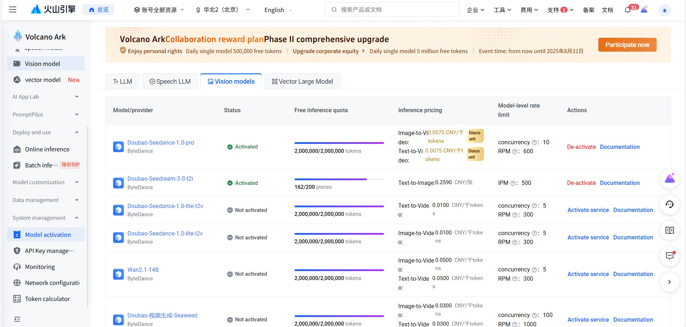
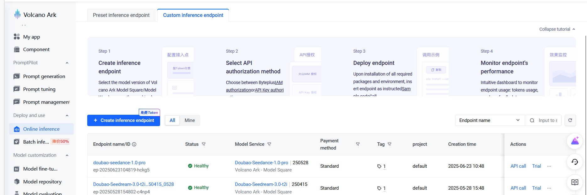
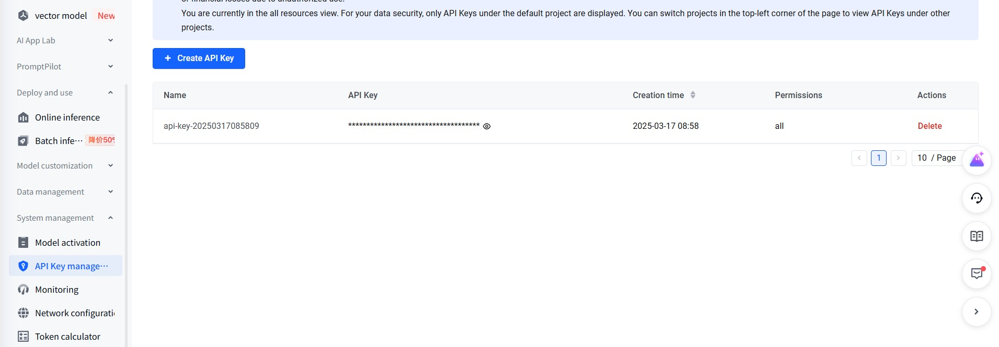

# Doubao Image Generation MCP Server

An image generation MCP server based on FastMCP framework and Volcano Engine API, supporting high-quality image generation through Doubao (doubao-seedream-3.0-t2i) model.

## 1. Features

- 🎨 **High-Quality Image Generation**: Based on Doubao seedream-3.0-t2i model, supports 2K resolution
- 🌐 **Bilingual Support**: Prompts support both Chinese and English descriptions
- 📐 **Multiple Resolutions**: Supports various resolutions from 512x512 to 2048x2048
- 🎯 **Precise Control**: Supports seed, guidance scale, watermark and other parameter controls
- 📁 **Local Storage**: Automatically downloads and saves generated images to specified directory
- 🔧 **MCP Protocol**: Fully compatible with MCP protocol, can be integrated with MCP-supported AI assistants
- 📊 **Detailed Logging**: Complete logging and error handling

## 2. Requirements

- Python >= 3.13
- Volcano Engine API Key
- Inference Endpoint Model ID

## 3. Installation & Configuration

### 3.1 Clone Project

```bash
git clone git@github.com:suibin521/doubao-image-mcp-server.git
cd doubao-image-mcp-server
```

### 3.2 Install Dependencies

Using uv (recommended):
```bash
uv sync
```

Or using pip:
```bash
pip install -e .
```

### 3.3 Configure Environment Variables

This project does not use `.env` files. All configurations are passed through the `env` field in the MCP JSON configuration file.

#### 3.3.1 Environment Variable Configuration Example
```json
"env": {
  "BASE_URL": "https://ark.cn-beijing.volces.com/api/v3",
  "DOUBAO_API_KEY": "your-dev-api-key-here",
  "API_MODEL_ID": "ep-20250528154802-c4np4",
  "IMAGE_SAVE_DIR": "C:/images"
}
```

#### 3.3.2 Environment Variable Detailed Description

**1. BASE_URL (API Base Address)**
- **Purpose**: Base API address for Doubao (Volcano Engine) platform
- **Default Value**: `https://ark.cn-beijing.volces.com/api/v3`
- **Description**: This is the API address for Volcano Engine platform in Beijing region, generally no need to modify
- **Example**: `"BASE_URL": "https://ark.cn-beijing.volces.com/api/v3"`

**2. DOUBAO_API_KEY (API Key)**
- **Purpose**: API key for authentication
- **How to Get**: Create and obtain from Volcano Engine console
- **Format**: Usually a UUID format string
- **Note**: Please keep your API key safe and do not leak it to others

**3. API_MODEL_ID (Model Endpoint ID)**
- **Purpose**: Specifies the inference endpoint ID of the image generation model to use
- **How to Get**: Obtained after creating an inference endpoint in Volcano Engine console
- **Format**: String starting with "ep-"
- **Example**: `"API_MODEL_ID": "ep-20250528154802-c4np4"`
- **Description**: Each inference endpoint has a unique ID to identify a specific model instance

**4. IMAGE_SAVE_DIR (Image Save Directory)**
- **Purpose**: Specifies the local directory path where generated images are saved
- **Path Format**: Supports both relative and absolute paths
- **Absolute Path Example**: `"IMAGE_SAVE_DIR": "C:/images"`
- **Description**: If the directory does not exist, the program will create it automatically

### 3.4 Get API Key and Model ID

#### 3.4.1 Register Volcano Engine Platform

Use the following URL to log in to Volcano platform and register. You can select the language (Chinese or English) in the upper right corner:

```
https://console.volcengine.com/auth/signup
```



#### 3.4.2 Login to Volcano Engine Console

After registration, visit the Volcano Engine console:

```
https://console.volcengine.com/ark/region:ark+cn-beijing/overview?briefPage=0&briefType=introduce&type=new
```

#### 3.4.3 Activate Image Generation Model "Doubao-Seedream-3.0-t2i"

1. Go to **System Management** → **Activation Management** interface
2. Select **Vision Large Model**
3. Find the **Doubao-Seedream-3.0-t2i** model
4. Click the **"Activate service"** button on the right to activate the service

Access link:
```
https://console.volcengine.com/ark/region:ark+cn-beijing/openManagement?LLM=%7B%7D&OpenTokenDrawer=false
```



#### 3.4.4 Create Inference Endpoint

1. In the console, click **Online inference** → **Create inference endpoint**
2. Enter the following information:
   - **Endpoint name**: Give your endpoint a name
   - **Endpoint description**: Add description information
   - **Model selection**: Select the **Doubao-Seedream-3.0-t2i** model you just activated
3. Click the **Create** button to create the endpoint
4. After creation, you can see the corresponding **Model_id** in the overview interface (format like: `ep-m-20250528154647-cx5fg`)



#### 3.4.5 Create API Key

1. Select **API Key management** on the right side of the console
2. Click **Create API Key**
3. Generate and save your API key (please keep it safe and do not leak it)



#### 3.4.6 Configuration Information Acquisition Complete

After completing the above steps, you will obtain the following configuration information:
- **BASE_URL**: `https://ark.cn-beijing.volces.com/api/v3` (fixed value)
- **DOUBAO_API_KEY**: The API key you just created
- **API_MODEL_ID**: The Model_id of the inference endpoint (like: `ep-m-20250528154647-cx5fg`)
- **IMAGE_SAVE_DIR**: Image save directory path

## 4. Usage

### 4.1 Configure MCP Server in Development Tools

This server supports use in various AI development tools, including VS Code + Cline, Cursor, Trae, etc. Configuration method is as follows:

#### 4.1.1 MCP Configuration File Setup

Add the following configuration to your MCP configuration file:

```json
{
  "mcpServers": {
    "doubao_image_mcp_server": {
      "command": "uvx",
      "args": [
        "doubao_image_mcp_server"
      ],
      "env": {
        "BASE_URL": "https://ark.cn-beijing.volces.com/api/v3",
        "DOUBAO_API_KEY": "your-dev-api-key-here",
        "API_MODEL_ID": "ep-20250528154802-c4np4",
        "IMAGE_SAVE_DIR": "C:/images"
      }
    }
  }
}
```

#### 4.1.2 Development Tool Configuration Instructions

**VS Code + Cline:**
- Find Cline extension configuration in VS Code settings
- Add the above MCP configuration to Cline's MCP server configuration

**Cursor:**
- Find MCP configuration options in Cursor settings
- Add the above configuration and restart Cursor

**Trae:**
- Add the above configuration to Trae's MCP configuration file
- Reload the configuration file after saving

#### 4.1.3 Usage Examples

After configuration, you can directly talk to the AI assistant to generate images:

**Usage Example in Cursor:**
1. Enter Agent mode
2. First let Cursor understand the image generation tool: "Please understand the available image generation tools"
3. Then directly make image generation requests: "Please help me generate a sunset seaside landscape image"

**Usage in Other Development Tools:**
- Directly describe the image you want to generate to the AI assistant
- The AI assistant will automatically call the Doubao image generation tool
- Generated images will be saved to your configured directory

### 4.2 Start Server Independently

```bash
python doubao_mcp_server.py
```

### 4.3 MCP Tool Calls

The server provides the following MCP tools:

#### 4.3.1 `doubao_generate_image`

Main tool for image generation.

**Parameters:**
- `prompt` (required): Image description text, supports Chinese and English
- `size` (optional): Image resolution, default "1024x1024"
- `seed` (optional): Random seed, if not specified, a random number will be auto-generated, default -1
- `guidance_scale` (optional): Guidance scale 1.0-10.0, default 8.0
- `watermark` (optional): Whether to add watermark, default true
- `file_prefix` (optional): File name prefix, English only

**Supported Resolutions:**
- `512x512` - 512x512 (1:1 Small Square)
- `768x768` - 768x768 (1:1 Square)
- `1024x1024` - 1024x1024 (1:1 Large Square)
- `864x1152` - 864x1152 (3:4 Portrait)
- `1152x864` - 1152x864 (4:3 Landscape)
- `1280x720` - 1280x720 (16:9 Widescreen)
- `720x1280` - 720x1280 (9:16 Mobile Portrait)
- `832x1248` - 832x1248 (2:3)
- `1248x832` - 1248x832 (3:2)
- `1512x648` - 1512x648 (21:9 Ultra-wide)
- `2048x2048` - 2048x2048 (1:1 Ultra Large Square)

**Example Calls:**

Basic call (using default parameters):
```json
{
  "tool": "doubao_generate_image",
  "arguments": {
    "prompt": "A cute orange cat sitting on a sunny windowsill, watercolor style"
  }
}
```

Full parameter call:
```json
{
  "tool": "doubao_generate_image",
  "arguments": {
    "prompt": "A cute orange cat sitting on a sunny windowsill, watercolor style",
    "size": "1024x1024",
    "seed": -1,
    "guidance_scale": 8.0,
    "watermark": false,
    "file_prefix": "cute_cat"
  }
}
```

Using specific seed to reproduce image:
```json
{
  "tool": "doubao_generate_image",
  "arguments": {
    "prompt": "A cute orange cat sitting on a sunny windowsill, watercolor style",
    "seed": 1234567890,
    "size": "1024x1024"
  }
}
```

### 4.4 MCP Resources

#### 4.4.1 `resolutions`

Get a list of all available image resolutions.

### 4.5 MCP Prompt Templates

#### 4.5.1 `image_generation_prompt`

Provides prompt templates for image generation, including all parameter descriptions and usage examples.

## 5. Project Structure

```
doubao-image-mcp-server/
├── doubao_mcp_server.py    # Main MCP server
├── doubao_image_gen.py     # Core image generation tool
├── pyproject.toml          # Project configuration and dependency management
├── uv.lock                 # Dependency lock file
├── .gitignore             # Git ignore file
├── LICENSE                # Open source license
├── README.md              # English project documentation
├── README_CN.md           # Chinese project documentation
├── mcp_json.md            # MCP configuration documentation
└── images/                # Documentation images directory
    ├── create_api_key.jpg
    ├── create_inference_endpoint.jpg
    ├── model_activation.jpg
    └── volcengine_signup.jpg
```

## Logging System

The project includes a complete logging system:

- **File Logging**: Saved in `log/` directory
- **Console Logging**: Output to stderr for debugging
- **Log Levels**: DEBUG, INFO, WARNING, ERROR

## Error Handling

- ✅ Environment variable validation
- ✅ Parameter type and range checking
- ✅ API call error handling
- ✅ Image download retry mechanism
- ✅ File save exception handling

## Technical Features

- **Asynchronous Processing**: Async image generation based on asyncio
- **Retry Mechanism**: Automatic retry for failed image downloads
- **Parameter Validation**: Complete input parameter validation
- **Modular Design**: Core functionality separated from MCP service
- **Type Annotations**: Complete type hint support

## FAQ

### Q: How to get API key?
A: Visit Volcano Engine console and create a new API key in API management.

### Q: Where to find Model ID?
A: After creating an inference endpoint in Volcano Engine console, you can find the ID in endpoint details.

### Q: What image formats are supported?
A: Currently generated images are saved in JPG format.

### Q: How to customize image save path?
A: Modify the `IMAGE_SAVE_DIR` variable in the environment configuration.

### Q: What to do if generation fails?
A: Check log files and confirm that API key, model ID, and network connection are working properly.

## License

This project is open source under the MIT License.

## Contributing

Welcome to submit Issues and Pull Requests to improve the project
