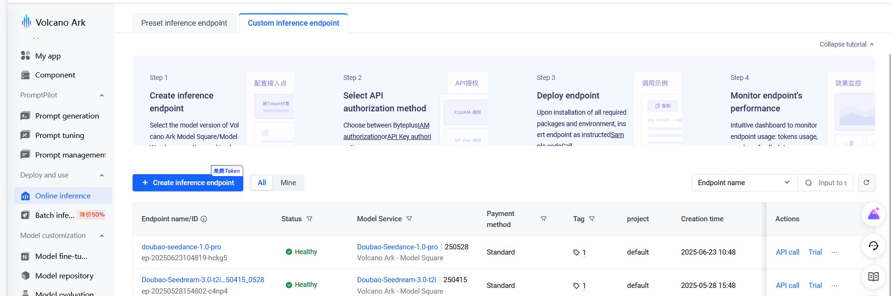

# 豆包图像 MCP 服务器

基于 FastMCP 框架和火山引擎 API 的图像生成 MCP 服务器，支持通过豆包（doubao-seedream-3.0-t2i）模型生成高质量图像。

## 1. 功能特性

- 🎨 **高质量图像生成**：基于豆包 seedream-3.0-t2i 模型，支持 2K 分辨率
- 🌐 **双语支持**：提示词支持中英文描述
- 📐 **多种分辨率**：支持从 512x512 到 2048x2048 的各种分辨率
- 🎯 **精确控制**：支持种子、引导强度、水印等参数控制
- 📁 **本地存储**：自动下载并保存生成的图像到指定目录
- 🔧 **MCP 协议**：完全兼容 MCP 协议，可与支持 MCP 的 AI 助手集成
- 📊 **详细日志**：完整的日志记录和错误处理

## 2. 系统要求

- Python >= 3.13
- 火山引擎 API 密钥
- 推理端点模型 ID

## 3. 安装配置

### 3.1 克隆项目

```bash
git clone git@github.com:suibin521/doubao-image-mcp-server.git
cd doubao-image-mcp-server
```

### 3.2 安装依赖

使用uv（推荐）:
```bash
uv sync
```

或使用pip:
```bash
pip install -e .
```

### 3.3 配置环境变量

本项目不使用 `.env` 文件。所有配置都通过 MCP JSON 配置文件中的 `env` 字段传递。

#### 3.3.1 环境变量配置示例
```json
"env": {
  "BASE_URL": "https://ark.cn-beijing.volces.com/api/v3",
  "DOUBAO_API_KEY": "your-dev-api-key-here",
  "API_MODEL_ID": "ep-20250528154802-c4np4",
}
```

#### 3.3.2 必需的环境变量

| 变量名 | 说明 | 示例 |
|--------|------|------|
| `DOUBAO_API_KEY` | 火山引擎 API 密钥 | `ak-xxx` |
| `API_MODEL_ID` | 推理端点模型 ID | `ep-20250528154802-c4np4` |
| `BASE_URL` | API 基础 URL（可选） | `https://ark.cn-beijing.volces.com/api/v3` |

### 3.4 获取火山引擎 API 凭证

#### 3.4.1 注册火山引擎账号
1. 访问 [火山引擎控制台](https://console.volcengine.com/)
2. 注册并完成实名认证
3. 进入「机器学习平台」>「模型推理」


#### 3.4.2 激活模型
1. 在模型推理页面，找到「doubao-seedream-3.0-t2i」模型
2. 点击「激活」并按提示操作
3. 等待激活完成


#### 3.4.3 创建推理端点
1. 模型激活后，点击「创建推理端点」
2. 配置端点参数（使用默认设置即可）
3. 等待端点创建完成
4. 复制端点 ID（格式：`ep-xxxxxxxxx`）



#### 3.4.4 创建 API 密钥
1. 进入「API 密钥管理」
2. 点击「创建 API 密钥」
3. 复制生成的 API 密钥（格式：`ak-xxxxxxxxx`）
4. **重要**：请妥善保存 API 密钥，无法再次查看


## 4. 使用方法

### 4.1 MCP 配置

在你的 MCP 客户端（如 Claude Desktop）中添加以下配置：

```json
{
  "mcpServers": {
    "doubao-image-mcp-server": {
      "command": "uv",
      "args": [
        "--directory",
        "/path/to/doubao-image-mcp-server",
        "run",
        "python",
        "doubao_mcp_server.py"
      ],
      "env": {
        "BASE_URL": "https://ark.cn-beijing.volces.com/api/v3",
        "DOUBAO_API_KEY": "your-api-key-here",
        "API_MODEL_ID": "your-endpoint-id-here"
      }
    }
  }
}
```

### 4.2 工具使用示例

#### 4.2.1 基础调用
```
生成一张美丽的日落风景图
```

#### 4.2.2 完整参数调用
```
生成一张赛博朋克风格的夜晚城市图，尺寸 1280x720，种子 12345，引导强度 9.0，无水印
```

#### 4.2.3 指定种子复现图片
```
生成一只可爱的小猫，种子 98765
```

## 5. 可用参数

### 5.1 图像尺寸

| 尺寸 | 比例 | 说明 |
|------|------|------|
| 512x512 | 1:1 | 小正方形 |
| 768x768 | 1:1 | 正方形 |
| 1024x1024 | 1:1 | 大正方形 |
| 864x1152 | 3:4 | 竖版 |
| 1152x864 | 4:3 | 横版 |
| 1280x720 | 16:9 | 宽屏 |
| 720x1280 | 9:16 | 手机竖屏 |
| 832x1248 | 2:3 | 竖版 |
| 1248x832 | 3:2 | 横版 |
| 1512x648 | 21:9 | 超宽屏 |
| 2048x2048 | 1:1 | 超大正方形 |

### 5.2 参数范围

| 参数 | 范围 | 默认值 | 说明 |
|------|------|--------|------|
| `seed` | -1 到 2147483647 | -1 | 随机种子（-1 为随机） |
| `guidance_scale` | 1.0 到 10.0 | 8.0 | 提示词遵循强度 |
| `watermark` | true/false | true | 是否添加水印 |
| `file_prefix` | 1-20 字符 | "image" | 文件名前缀 |

## 6. 输出结果

生成的图像保存到 `./images` 目录，文件命名规则：
```
{file_prefix}_{timestamp}.jpg
```

示例：`image_1703123456.jpg`

## 7. 错误处理

服务器为常见问题提供详细的错误信息：

- **缺少 API 密钥**：检查 `DOUBAO_API_KEY` 环境变量
- **无效模型 ID**：验证 `API_MODEL_ID` 是否正确
- **无效参数**：检查参数范围和格式
- **网络问题**：检查网络连接和 API 端点
- **配额超限**：检查火山引擎账户余额

## 8. 开发

### 8.1 项目结构
```
doubao-image-mcp-server/
├── doubao_image_gen.py      # 核心图像生成模块
├── doubao_mcp_server.py     # MCP 服务器实现
├── pyproject.toml           # 项目配置
├── README.md                # 英文文档
├── README_CN.md             # 中文文档
├── LICENSE                  # MIT 许可证
└── images/                  # 生成图像目录
    ├── create_api_key.jpg
    ├── create_inference_endpoint.jpg
    ├── model_activation.jpg
    └── volcengine_signup.jpg
```

### 8.2 测试

直接运行服务器进行测试：
```bash
python doubao_mcp_server.py
```

### 8.3 贡献

1. Fork 仓库
2. 创建功能分支
3. 进行更改
4. 如适用，添加测试
5. 提交 Pull Request

## 9. 许可证

本项目采用 MIT 许可证 - 详见 [LICENSE](LICENSE) 文件。

## 10. 支持

如果遇到任何问题或有疑问：

1. 查看 [Issues](https://github.com/suibin521/doubao-image-mcp-server/issues) 页面
2. 创建新的 issue 并提供详细信息
3. 包含错误信息和配置详情

## 11. 更新日志

### 版本 1.0.0 (2024-06-24)
- ✨ 首次发布
- 🎨 支持豆包图像生成
- 🔧 完全兼容 MCP 协议
- 📐 多分辨率支持
- 🎯 高级参数控制
- 📁 本地图像存储
- 🌐 双语文档

---

**注意**：本项目与火山引擎或字节跳动没有官方关联。这是使用其公共 API 的独立实现。
